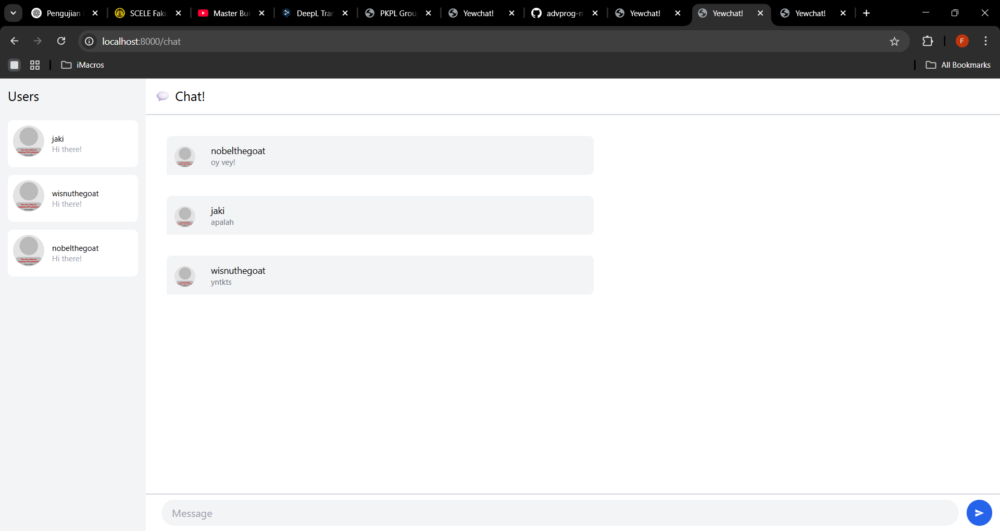
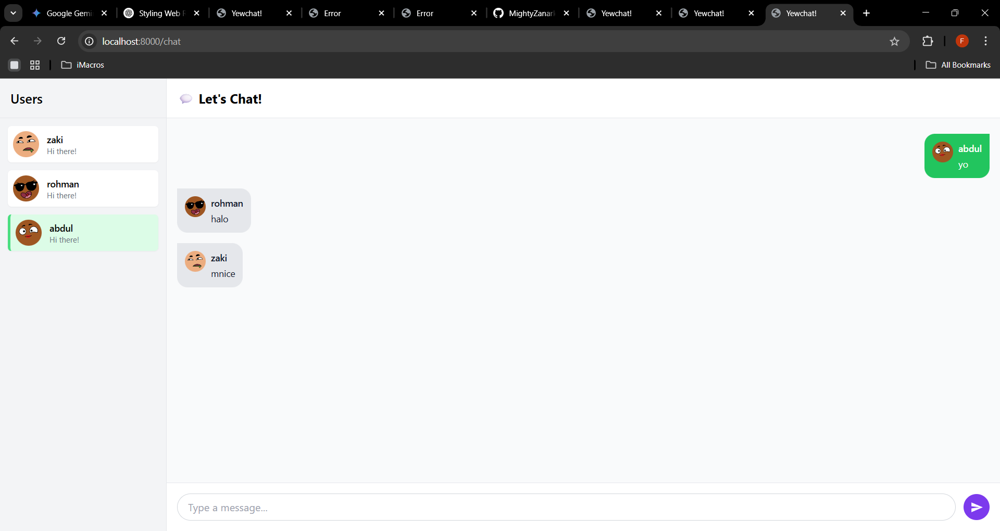

## 3.1

berikut tampilan original dari code original yang diberikan. Terdapat 3 user yang masing-masing mengeim pesan

## 3.2
 

Sebagai bagian dari Experiment 3.2, saya menambahkan elemen kreatif pada webchat seperti avatar unik dari Dicebear untuk tiap pengguna, penanda visual untuk pengguna saat ini (highlight hijau dan bubble pesan di sisi kanan), serta UI modern menggunakan TailwindCSS. Input pesan dibuat sticky di bawah, dan tombol kirim didesain dengan ikon agar lebih interaktif.